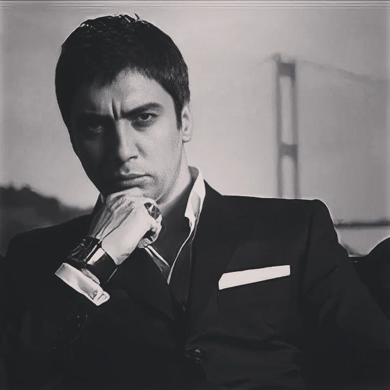

# Sam12 Portfolio 🌐

[](https://your-portfolio-link.com)
[](mailto:isroilarslonov5@gmail.com)
[)
[](https://www.facebook.com/isroil.arslonov.5/)
[](https://www.instagram.com/samuell_12turkiy/)

**Samuel_12turkiy** — Web Developer va Designer.  


---

## 🚀 About Me
Men **VenaSoft** kompaniyasida dizayn va web development bo‘yicha ishlayman.  
Murakkab muammolarni sodda, intuitiv va go‘zal dizaynlarga aylantirishga e’tibor qarataman.  

  

---

## 🛠 Skills & Technologies

### Frontend
- HTML5 & CSS3  
- JavaScript (ES6+)  
- Responsive Design  
- UI/UX Principles  

### Backend
- PHP, Node.js (agar ishlatilsa)  

### Other Skills
- Web Security & Site Inspection  
- Creative Design  
- Portfolio Management  

### Skill Progress
**HTML**  
  
**JavaScript**  
  
**Java**  
  

---

## 🎓 Education
- **Kashkadarya Professional Academy** (2018-2023)  
  Web Developer, Frontend & Backend  

- **VenaSoft Training Center** (2023-)  
  Advanced Web Development & Design  

---

## 💼 Portfolio Highlights

| Project | Category | Screenshot |
|---------|----------|-----------|
| Finance | Web Development |  |
| Orizon | Web Development |  |
| Fundo | Web Design |  |
| Brawlhalla | Application |  |
| DSM. | Web Design |  |
| MetaSpark | Web Design |  |
| Summary | Web Development |  |
| Task Manager | Application |  |
| Arrival | Web Development |  |

> To‘liq portfolio saytda mavjud.

---

## 📫 Contact Me

- **Email:** [isroilarslonov5@gmail.com](mailto:isroilarslonov5@gmail.com)  
- **Phone:** [+998950970120](tel:+998950970120)  
- **Facebook:** [Samuel_12turkiy](https://www.facebook.com/isroil.arslonov.5/)  
- **Instagram:** [@samuell_12turkiy](https://www.instagram.com/samuell_12turkiy/)  
- **Location:** Uzbekistan, Kashkadarya, VenaSoft company  

---

## 📝 How to Run

1. Klonlang:
```bash
git clone https://github.com/username/portfolio.git
